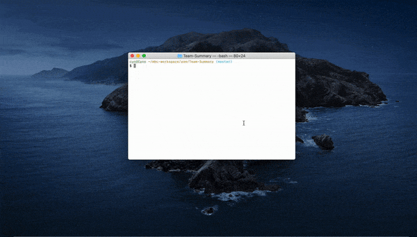

# Team Profile Generator / Employee Summary



## Description

Team profile generator is a command line application which generates a HTML page with the development team's information summary. 

## User story

> As a manager
> I want to generate a webpage that displays my team's basic info
> so that I have quick access to emails and GitHub profiles

## Instructions

### Prerequisite

    1. Commandline applications such as Mac's terminal or Windows' Command Prompt.
    2. [Node.js](https://nodejs.org/en/download/)

### Installation

    1. Open your terminal.
    2. In your terminal, navigate to the application folder.
    3. run the following command: 
        ```sh
            $ npm install
        ```

### Usage of the application

    1. Open your terminal.
    2. Run the following command: 
        ```sh
            $ npm start
        ```
    3. Select the user's name in the list.
    4. Select the names of the team members.
    5. Press Enter to generate the roster.
    6. Generated roster will be saved in the pre-defined folder and opened in the default browser. 
    7. If there are staff left un-assigned, program will ask the user if they wants to create another team. 
    8. Press 
        * "y" to create a new roster, or
        * "n" to exit the program.

## Future Development

Current version uses data saved in data/employee file. This can later be implemented to retrieve employees' data from a database.
